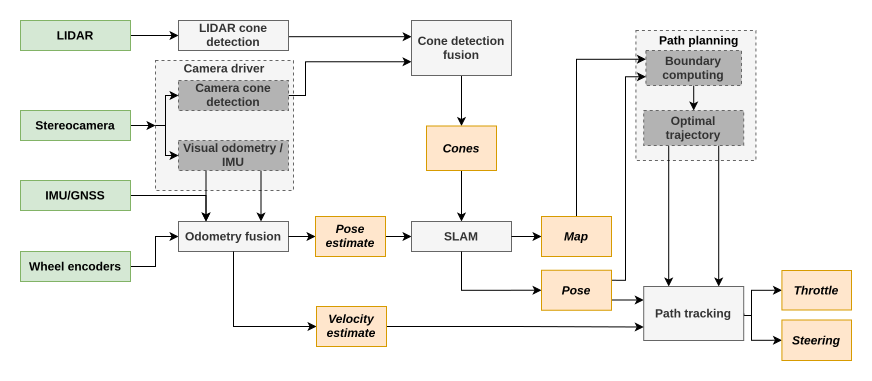
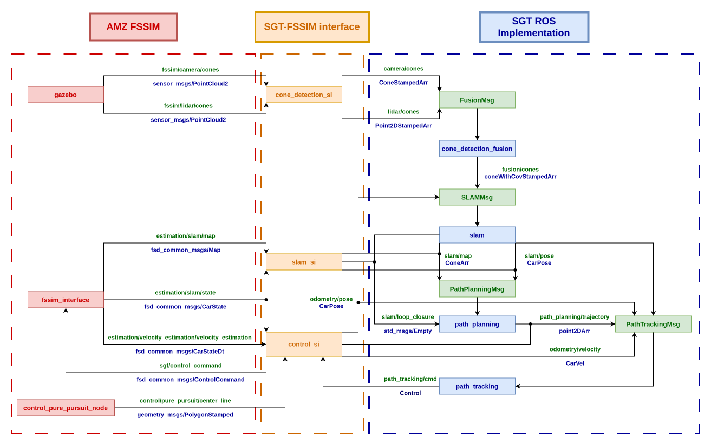
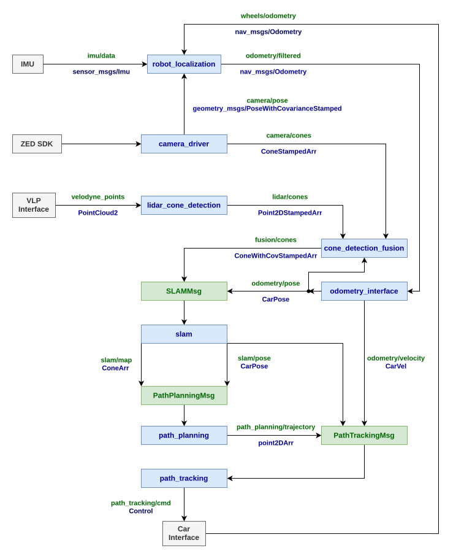

# ROS Implementation workspace
___

© **SGT Driverless**

Implementation of autonomous system for ROS in C++
___

## Introduction
This ROS workspace contains packages providing a complete autonomous workflow of a Formula Student Driverless car of STUBA Green Team starting from environment perception and resulting in control commands computation.

<p align="center">
    
</p>
<figcaption align = "center">SGT-DV architecture</figcaption>

[**Keep up to date*](https://drive.google.com/file/d/1iMFfZ8oNLDB1jh61XK2_ugi4TykpmphU/view?usp=sharing)

The whole workflow can be run and tested in these modes:
* [**FSSIM**](./doc/FSSIM_testing.md) - running all or particular nodes with [FS Simulator](https://gitlab.com/sgt-driverless/simulation/fsd_skeleton). Can be done on any PC. In this case, the simulator provides both the complete physical layer of the autonomous car and the autonomous system workflow, which, however, can by connected to / replaced by our nodes to test the algorithms.  

<p align="center">
  
</p>
<figcaption align = "center">ROS nodes and topics - FSSIM setup</figcaption>

*  **RC car** - running all or particular nodes on the Nvidia Jetson Xavier onboard PC connected to real sensors and VESC controller - a driver for RC car motors.  

<p align="center">
  
</p>
<figcaption align = "center">ROS nodes and topics - RC car setup</figcaption>
  
* **Formula car** - not implemented yet.

###  List of packages

**Core**
* [`camera_driver`](src/camera_driver/README.md)
* [`lidar_cone_detection`](src/lidar_cone_detection/README.md)
* [`fusion`](src/fusion/README.md)
* [`slam`](src/slam/README.md)
* [`path_planning`](src/path_planning/README.md)
* [`path_tracking`](src/path_tracking/README.md)
* [`master`](src/master/README.md)
* [`sgtdv_msgs`](src/sgtdv_msgs/README.md)

**Supporting**
* [`jetson_can_interface`](src/jetson_can_interface/README.md)
* [`vesc_interface`](src/vesc_interface/README.md)
* [`mapper`](src/mapper/README.md)
* [`measurement_models`](src/measurement_models/README.md)
* [`odometry_interface`](src/odometry_interface/README.md)
* [`ptp_trajectory`](src/ptp_trajectory/README.md)
* simulation interface
  * [`cone_detection_si`](src/simulation_interface/cone_detection_si/README.md)
  * [`control_si`](src/simulation_interface/control_si/README.md)
  * [`slam_si`](src/simulation_interface/slam_si/README.md)
* [`visual_odometry`](src/visual_odometry/README.md)
* visualization
  * [`data_visualization`](src/visualization/data_visualization/README.md)
  * [`debug_visualization`](src/visualization/debug_visualization/README.md)

**External**
* [`robot_localization`](src/robot_localization/README.md)
* [`velodyne`](src/velodyne/README.md)

## Installation

### A first-time setup (On your laptop)
#### Prerequisities:
* Linux Ubuntu 20 based OS
* [ROS Noetic installation](http://wiki.ros.org/noetic/Installation/Ubuntu)

1. Clone the git repo  
    a. Clone with HTTPS - Requires submitting username and password for every operation with remote  
  
    ```sh
    $ git clone --recurse-submodules https://gitlab.com/stubagreenteam/submodules_ros/ros_implementation.git
    ```
  
    b. Clone with SSH (recommended) - Follow [these steps](https://docs.gitlab.com/ee/user/ssh.html) to configure SSH access to the GitLab repo for your account, then:
    
    ```sh
    $ git clone --recurse-submodules git@gitlab.com:stubagreenteam/submodules_ros/ros_implementation.git
    ```
2. *RECOMMENDED*: Add environment variables into the `~/.basrc` file:
   
    ```sh
    $ cd ros_implementation
    $ echo "# SGT environment variables" >> ~/.bashrc
    $ echo "export SGT_ROOT="$(pwd) >> ~/.bashrc
    $ echo "alias SGT_source=\"source \${SGT_ROOT}/devel/setup.bash; echo \\\"SGT ros_implementation workspace activated\\\"\"" >> ~/.bashrc
    ```

3. Install all necessary packages and utilities
    
    ```sh
    $ sudo chmod 777 install_dependencies.sh # if necessary
    $ ./scripts/install_dependencies.sh
    ```

### Nvidia Jetson Xavier setup
*TODO*


## Docker utilization (currently not maintained)
Momentalne je spravena iba konzolova verzia ubuntu 18.04 s povolenimi oknami (cize zobrazenie aplikacnych okien funguje)  

Treba mat nainstalovany nvidia container https://github.com/NVIDIA/nvidia-docker  
Konkretne:  
### Ubuntu 16.04/18.04/20.04, Debian Jessie/Stretch/Buster
```sh
# Add the package repositories
distribution=$(. /etc/os-release;echo $ID$VERSION_ID)
curl -s -L https://nvidia.github.io/nvidia-docker/gpgkey | sudo apt-key add -
curl -s -L https://nvidia.github.io/nvidia-docker/$distribution/nvidia-docker.list | sudo tee /etc/apt/sources.list.d/nvidia-docker.list

sudo apt-get update && sudo apt-get install -y nvidia-container-toolkit
sudo systemctl restart docker
```

#### CentOS 7.X/8.X (docker-ce), RHEL 7.X/8.X (docker-ce), Amazon Linux 1/2
```
distribution=$(. /etc/os-release;echo $ID$VERSION_ID)
curl -s -L https://nvidia.github.io/nvidia-docker/$distribution/nvidia-docker.repo | sudo tee /etc/yum.repos.d/nvidia-docker.repo

sudo yum install -y nvidia-container-toolkit
sudo systemctl restart docker
```

Spustit cez  prikaz (treba zmenit cesu k suborom v ```-v``` casti)
```sh
xhost +
docker build -f Dockerfile-gl -t sgt_ros_implementation_gl . && docker run -p 5900:5901 -e DISPLAY=$DISPLAY -v /tmp/.X11-unix:/tmp/.X11-unix -v <your path to ros_implementation>:/usr/src/ROS_implementation/ --privileged -it --network host --gpus all sgt_ros_implementation_gl
```

A nasledne skompilovanie:
```sh
cd /usr/src/ROS_implementation/  
catkin_make -j1 -l1
```

